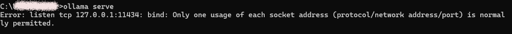
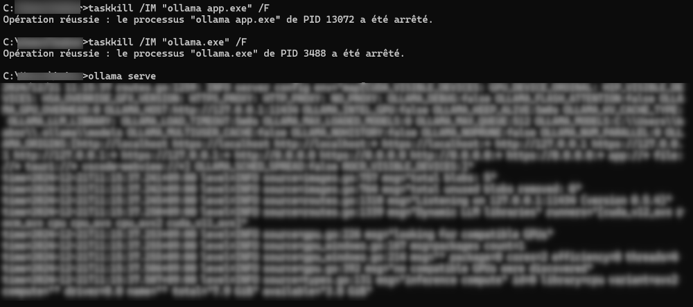
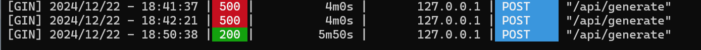
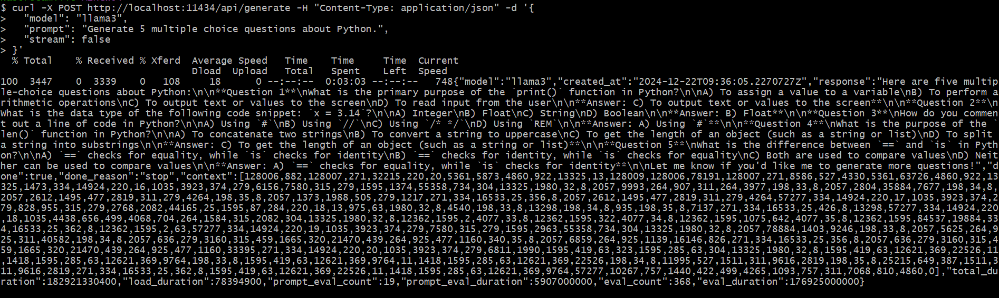

# <p style="text-align:center;">QuizMasterAI 🤖👩🏾‍💻</p>
## Introduction
For my CS50's Web Programming with Python and JavaScrip final project, I developed QuizMaster AI, an interactive web-based application for easily creating, managing, and attempting quizzes on any topics.It offers an engaging learning experience through adaptive questioning and immediate feedback.🦾  
This project includes several functionalities such as dynamic question generation, leaderboard rankings, and personalized user progress tracking.  
The project was inspired by my experience in creating quiz's videos on social media using AI tools and I had a idea about creating a quiz's web application where the quizzes are directly generated by the Artificial Intelligence as well. With the knowledge I obtained with this course and some research I created this app.
QuizMaster AI leverages the Ollama API to generate unique questions on-demand. This creates a virtually unlimited pool of practice material while ensuring questions remain fresh and challenging. (The application covers a wide range of technology and science topics,)

## Distinctiveness and Complexity

### Distinctiveness
QuizMasterAI is different from other projects due to these features:
1. **AI Integration and Dynamic Question Generation:** Quiz questions are generated in real-time using an Ollama API(as it run locally and it is free), providing variety and freshness for repeated attempts.
2. **User Progress Tracking:** Detailed tracking of user performance, including scores, attempts, and progress across topics.
3. **Leaderboard Metrics:** Leaderboards are filtered by topic and time range (weekly and monthly) to encourage competition.
4. **Test:**  Added Unit tests to validate core application functionalities, such as quiz creation and user progress tracking.

### Complexity
1. **API:** The project integrates Ollama API for question generation, requiring advanced parsing and validation techniques.
2. **Complex Data Relationships:**  The database schema involves intricate relationships between Users, Topics, Quizzes, Questions, and Answers, with additional *UserTopicProgress* tracking. This complexity required careful consideration of database queries and optimization.
3. **Custom Logic:** Extensive use of Django ORM for dynamic filtering, pagination, and leaderboard computation.
4. **Error Handling:** Error handling ensures smooth operation during quiz generation and API interactions.Response parsing to ensure reliable question generation.
5. **Interactive UI:** The interface features real-time progress updates, animated transitions, and dynamic content loading, implemented using JavaScript and Bootstrap. The pagination system for topics and the category filtering mechanism demonstrate advanced front-end functionality.


## File Overview

```
QuizMasterAI/                   # project directory
├── .gitignore                  # .gitignore for ignoring unnecessary files
├── manage.py                   # Django management script
├── requirements.txt            # Dependencies for the project
├── requirements-test.txt       # Dependencies for the project testing
├── README.md                   # Information about the project
├── README_Images/              # Images used in README.md
├── quiz/                       # Quiz application
│   ├── migrations/             # Database migration files
│   ├── static/                 # Static files for the quiz app
│   │   └── quiz/
│   │       ├── images/         # Images using in the application
│   │       ├── main.js         # JavaScript file for interactive functionalities
│   │       └── styles.css      # CSS file for styling the quiz app
│   ├── templates/              # HTML templates
│   │   └── quiz/
│   │       ├── feedback.html       # Feedback page for quiz answers
│   │       ├── landing_page.html   # Landing page for the application
│   │       ├── layout.html         # Base layout template
│   │       ├── leaderboard.html    # Leaderboard page
│   │       ├── login.html          # Login page for users
│   │       ├── profile.html        # User profile page
│   │       ├── quiz_question.html  # Quiz question page
│   │       ├── register.html       # Registration page for new users
│   │       ├── results.html        # Results page after completing a quiz
│   │       └── topic_list.html     # Page listing quiz topics
│   ├── admin.py                # Django admin configurations
│   ├── apps.py                 # App configuration
│   ├── models.py               # Django models
│   ├── tests.py                # Unit tests
│   ├── urls.py                 # App-specific URLs
│   └── views.py                # Django views
├── quizmaster/                 # Project configuration
│   ├── __init__.py             # Indicates a Python package
│   ├── asgi.py                 # ASGI configuration
│   ├── settings.py             # Project settings
│   ├── urls.py                 # Project-level URL routing
│   └── wsgi.py                 # WSGI configuration
└── db.sqlite3                  # SQLite database file

```

### Core Application Files
- **`quizmaster/settings.py`:** Django settings, including database configurations and third-party integrations.
- **`quiz/urls.py`:** URL configuration for all application routes.
- **`quiz/models.py`:** Defines the database models:
  - User
  - Topic (quiz subjects with metadata)
  - Quiz (tracks individual quiz attempts)
  - Question and Answer (stores quiz content)
  - UserTopicProgress (tracks learning progress)
- **`quiz/views.py`:** Contains all view functions including:
  - Quiz generation and management
  - User authentication and profile handling
  - Progress tracking and analytics
  - Leaderboard functionality
- **`quiz/admin.py`:** Ability to create topics with categories and difficulty. Information about generated questions and answer, and details about taken quizzes.
- **`quiz/tests.py`:** Placeholder for unit tests to validate the application.

### Templates
- **`quiz/templates/quiz/`**:
  - `layout.html`: Base template with navigation and layout structure
  - `landing_page.html`: Welcome page and application overview
  - `topic_list.html`: Display all topics with the categories plus a search section
  - `quiz_question.html`: Main quiz interface
  - `feedback.html`: Answer feedback with explanations
  - `results.html`: Quiz completion summary
  - `profile.html`: User statistics and progress tracking
  - `leaderboard.html`: Competitive rankings
  - `login.html`: Login interface
  - `register.html`: Register or sign up interface

### Static Files
- **`quiz/static/quiz/`**:
  - `main.js`: JavaScript for interactive features
  - `styles.css`: Custom styling and animations

### Configuration and Dependencies
- **`requirements.txt`:** Lists all dependencies required for the application.
- **`requirements-test.txt`:** Lists all dependencies required for testing the application.
- **`.gitignore`:** defines files to be ignored by Git

## How to Run QuizMasterAI

### Prerequisites
- Python 3.8+
- Django 4.x
- Ollama
- Virtual environment tool (e.g., `venv` or `virtualenv`)

### Installation
1. Set up a virtual environment:
   ```bash
   python -m venv quizmaster_env
   source quizmaster_env/bin/activate  # On Windows, use `quizmaster_env\Scripts\activate`
   ```
2. Install dependencies:
   ```bash
   pip install -r requirements.txt
   pip install -r requirements-test.txt
   deactivate
   ```

3. Install and start Ollama:  
First dowload Ollama at https://ollama.com/download/  
Open a new terminal and run the following commands:
    ```bash
    # Follow installation instructions at https://github.com/ollama/ollama
    ollama run llama3
    ```
    After installing llama3. Exit by using /bye.  
    Then run the following command. This is crucial for the quiz to be generated correctly  
    ```bash
    ollama serve
    ```

    The error will probably occur:
    

    To resolve this, we need to terminate two processes by run the following command  
    In Windows:
    ```bash
    taskkill /IM "ollama app.exe" /F
    taskkill /IM "ollama.exe" /F
    ```
    In macOS or Linux:
    ```bash
    pkill -f "ollama app.exe"
    pkill -f "ollama.exe"
    ```
    Then run again `ollama serve`.
    If it does not help, please refers to [Troubleshooting](#troubleshooting).

    

    `Note`: This part insure that ollama is running while using the application. So please don't interrupt it and let it running while using the app. That why we need to open 2 terminals. After finish to use the application just press <kbd>Ctrl</kbd> + <kbd>C</kbd>  to stop the process.

4. In the previous terminal apply migrations and Setup the database:
   ```bash
   python manage.py makemigrations
   python manage.py migrate
   ```

4. Create an admin user:
    ```bash
    python manage.py createsuperuser
    ```

5. Start the server:
   ```bash
   python manage.py runserver
   ```

### Usage
1. Open a browser and navigate to `http://127.0.0.1:8000`.(The port <kbd>8000</kbd> might be different)
2. Register to access quiz functionalities.
3. Add topics with category and difficulty in the admin page.
4. In the Topics page choose a topic to start a quiz.
5. View progress in the profile page and compare performance on the leaderboard.

## APIs Used
- **AI Question Generator API:** Generates quiz questions dynamically based on the selected topic.
  - Endpoint: `http://localhost:11434/api/generate`
  - Example Request:
    ```json
    {
      "model": "llama3",
      "prompt": "Generate 5 multiple choice questions about [Topic].",
      "stream": false
    }
    ```

## Unit test
- To run the tests:
```bash
python manage.py createsuperuser
```
- To run specific test cases:
```bash
python manage.py test quiz.tests.ModelTests
python manage.py test quiz.tests.ViewTests.test_topic_list_pagination
```

## Additional Information
- The application requires Ollama API access for question generation
- Admin can create and manage topics through the Django admin interface
- Browser cookies must be enabled for session management

## Known Issues
- The generation of the quiz after clicking "start quiz" might take some time depending of your machine performance(CPU/RAM/GPU).
- Limited fallback logic if the API fails to generate questions.

## Troubleshooting
**If there is still a error while running <kbd>ollama serve</kbd>**  
In Windows:
```bash
# Check if port 11434 is in use
netstat -ano | findstr 11434
# Example of output
C:\Windows\System32>netstat -ano | findstr 11434
  TCP    127.0.0.1:11434        0.0.0.0:0              LISTENING       11924
# kill the process
taskkill /F /PID 11924
```
Or try to run <kbd>ollama serve</kbd> with a different port.

**If these two errors appear:**

- The logs from <kbd>ollama serve</kbd> indicate <kbd>500</kbd> errors, meaning an internal server error occurred while processing the /api/generate endpoint like the image below.

- Django logs show a Read timed out error when trying to connect to http://localhost:11434. This happens because the API server (Ollama) fails to respond within the configured timeout period (30 seconds).
    ```bash
    [22/Dec/2024 18:12:53] "GET /topics/ HTTP/1.1" 200 26003
    Error generating questions: HTTPConnectionPool(host='localhost', port=11434): Read timed out. (read timeout=30)
    Error generating questions: HTTPConnectionPool(host='localhost', port=11434): Read timed out. (read timeout=30)
    [22/Dec/2024 18:13:32] "GET /quiz/start/26/ HTTP/1.1" 302 0
    [22/Dec/2024 18:13:32,804] - Broken pipe from ('127.0.0.1', 51458)
    [22/Dec/2024 18:13:33] "GET /quiz/89/ HTTP/1.1" 200 5799
    ```

Ensure the model specified in the code (llama3) is available and loaded successfully. 

```bash
curl -X POST http://localhost:11434/api/generate -H "Content-Type: application/json" -d '{
  "model": "llama3",
  "prompt": "Generate 5 multiple choice questions about Python.",
  "stream": false
}'
```
`If not`, If the API returns a <kbd>500</kbd> error or takes too long, there might be an issue with the model.  
`If yes`, verify <kbd>Time Total</kbd> to know approximately how much time the model(llama3) takes to respond.



Please considere increase the timeout in `views.py` in the function *generate_quiz_questions*:
```python
 response = requests.post(
            OLLAMA_URL,
            json={
                "model": "llama3", # Name of the model. Can be change depending of your needed and the power of your machine 
                "prompt": prompt,
                "stream": False  # Important: disable streaming for proper JSON response
            },
            timeout=30  # Add timeout to prevent hanging(consider increase it according to the response time of the model)
        )
```
- The high response time (30+ seconds) suggests that the model might be too large for the system(CPU/RAM/GPU) to handle efficiently.
- Consider using a smaller model or upgrading the hardware.

## Features I would like to improve/add
- Add support for multiple languages.
- Enable any user to add a topic and attempt the quiz of their chose instead to create topics in the admin page.

---
Thank you for taking the time to read and understand QuizMasterAI!🙂‍↕️  
I learnt a lot in this course.  
Thank you to the people who made the course [CS50's Web Programming with Python and JavaScript](https://www.edx.org/learn/web-development/harvard-university-cs50-s-web-programming-with-python-and-javascript)  possible and to [edX](https://www.edx.org/) for giving us possibility to get a certification.

